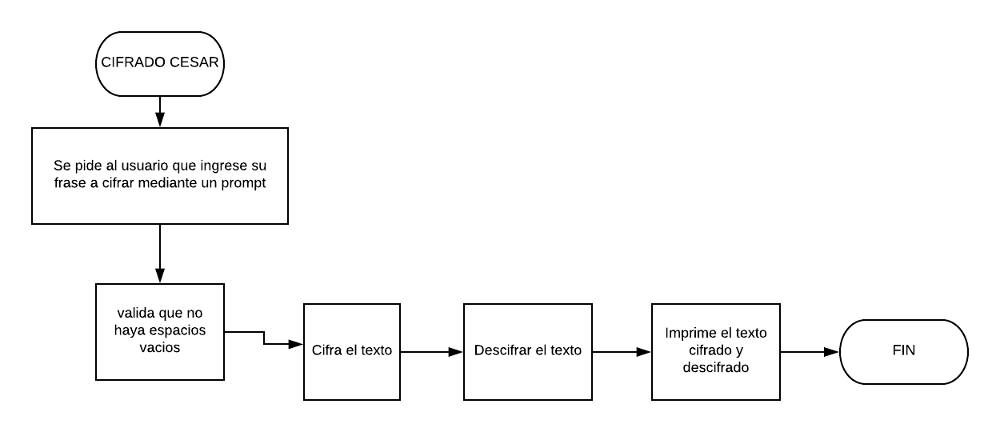

# Productos Finales

## Descripcion de cada producto

### CIFRADO CÉSAR

Crea una web que pida, por medio de un prompt(), una frase al usuario y devuelva el mismo mensaje encriptado según el algoritmo de Cifrado César con el parámetro de desplazamiento de 33 espacios hacia la derecha

Por ejemplo:

Texto original: ABCDEFGHIJKLMNOPQRSTUVWXYZ
Texto codificado: HIJKLMNOPQRSTUVWXYZABCDEFG

## Pseudocódigo
### Descripción

1. Pedir, mediante un prompt, que el usuario ingrese la cadena a encriptar
3. *CIFRAR*  la cadena de texto que ingreso el cliente,  con base en ASCII.
4. Imprimir los resultados de la cadena encriptada mediante un alert.
5. Terminar el proceso.    

## Diagrama de flujo
Nota. El diseño del diagrama de flujo esta basado en https://sites.google.com/a/itesm.mx/proyecto-1erparcial-multimedia-itesmaa3700/menu-de-opciones-con-un-diagrama-de-flujo .

